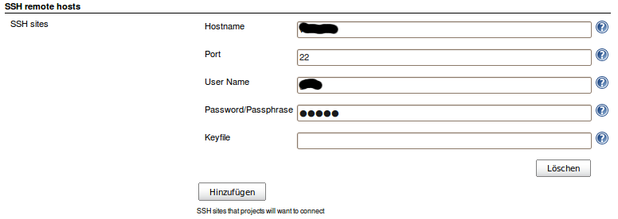
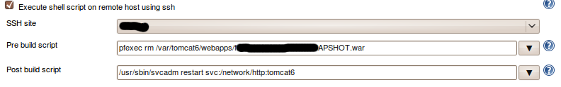
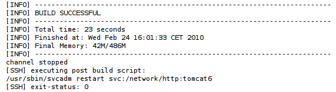

# ssh-plugin

## About

This is a Jenkins plugin that allows for you to run operations with SSH. (I.e. commands, file management etc)
This plugin was derived from the very cool [SCP Plugin](https://plugins.jenkins.io/scp/).

## Usage Documentation and Examples

First go to the global configuration page and add a SSH site.



For your job select a configured site and enter the shell commands that should be executed before and after the build.



Log will look like this.



## TODO

- i18n
- we also need a post deploy script (ask some of the core team how to do that)
- investigate stop behavior of Hudson jobs using the ssh Plugin
- use same sites as scp plugin (plugin dependencies???)
- ...

## Building this project

```shell
mvn install
```

## Contribute

Fork and send a pull request (or create an issue on GitHub or in JIRA)
